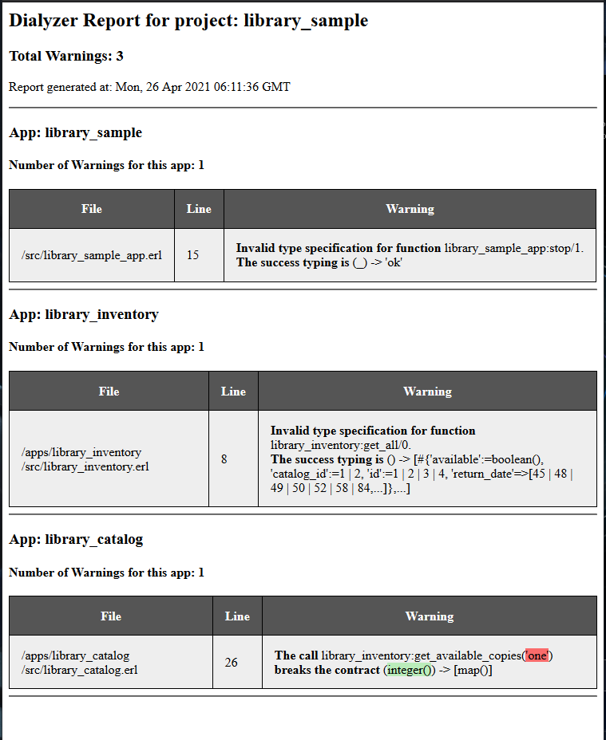

rebar3_dialyzer_html
=====

A rebar plugin to generate HTML reported from dialyzer raw results.

Intro blog post: https://www.srijn.net/erlang-dialyzer-html-reports-rebar3/

Also available on hex: https://hex.pm/packages/rebar3_dialyzer_html

Build
-----

    $ rebar3 compile

Sample Report
-------------

Use
---

1. Make sure you're using rebar3 version `3.15` or later.

2. Add the plugin to your rebar config (via hex or via git):

       {plugins, [
           %% from hex
           {rebar3_dialyzer_html, "0.2.0"}
    
           %% or, latest from git
           {rebar3_dialyzer_html, {git, "https://github.com/srijan/rebar3_dialyzer_html.git", {branch, "main"}}}
       ]}.

3. Select raw format for the dialyzer warnings file generated by rebar3:

       {dialyzer, [
           {output_format, raw}
       ]}.

4. Run the `dialyzer_html` rebar3 command:

       $ rebar3 dialyzer_html
       ===> Fetching rebar3_dialyzer_html
       ===> Compiling rebar3_dialyzer_html
       ===> Generating Dialyzer HTML Report
       ===> HTML Report written to _build/default/dialyzer_report.html

Changelog
---------

- 0.2.0: Basic functionality using JS library
- 0.1.0: Pre-Release
